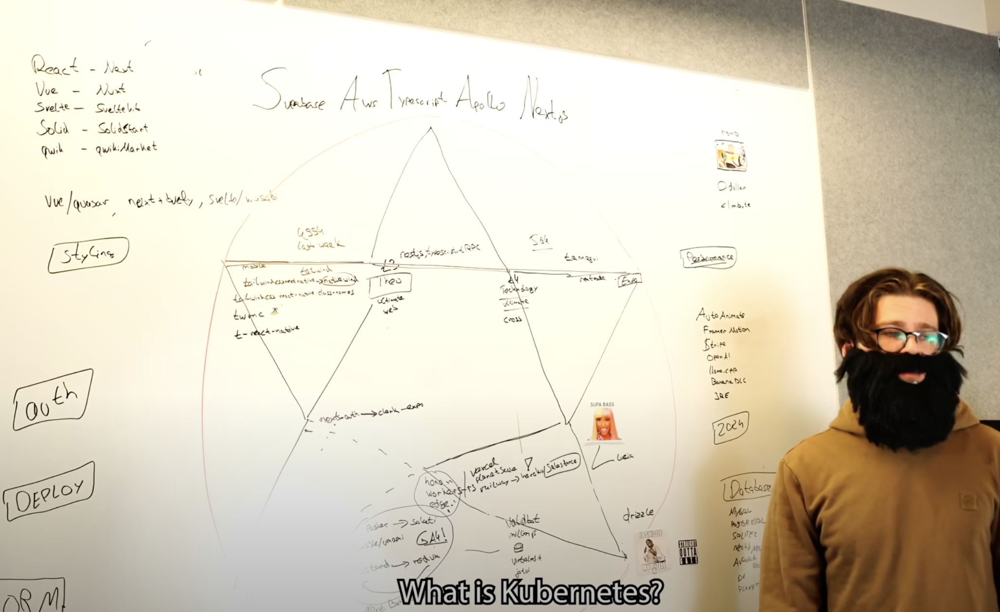

<style>
     h1 {
        font-weight: normal;
        line-height: 1.5em;
        font-size: 28px;
        margin-bottom: 10px;
    }
    .post-title {
        margin-bottom: -0.5rem;
    }
    blockquote {
        margin-left: 10px;
        margin-right: 10px;
    }
    h2 { font-weight: normal; }
    .w {
        padding: 3em 1em;
    }
</style>

## Exploring Cloudflare Workers



The JavaScript landscape has always been a fertile ground for innovation. New frameworks, libraries, and platforms emerge every years, each promising to simplify development or enhance performance in unique ways. This constant churn of ideas and implementations can be overwhelming, but it also represents an opportunity to push the boundaries of what we can achieve as developers. How many languages enable you to build services, web UI and native apps at the same time? If you want a fresh look on where full stack JS framework are going, your only stop should be [Solid JS Start](https://start.solidjs.com/) and [Ryan Youtube Channel](https://www.youtube.com/@ryansolid).

This speed at which our ecosystem evolves can also be prone to be comical, the [Programmers are also human Youtube channel](https://www.youtube.com/watch?v=aWfYxg-Ypm4) hits right in the heart of what makes the JS landscape so overwheling.

It also makes choosing long-term technolgies difficult, I want to build software that I can enjoy building for years to come, and picking out small libraries tend to get you in situation where half your stack isn't maintained anymore, and that's just sad..

Rant off, I wanted to test out what 2024 had to offer with a small side project and here how it went.

## The Technologies

For this project, I chose to leverage the Cloudflare stack. Why Cloudflare? Because it offers a rich set of tools, a generous free tier, and a rapidly evolving ecosystem. Here's the stack:

- **[Cloudflare Pages](https://pages.cloudflare.com/)** to host my static site and front-end app (no Next.js here).
- **[Cloudflare Workers](https://workers.cloudflare.com/)** to serve my API.
- **[Cloudflare D1](https://developers.cloudflare.com/d1/)** as my database.
- **[Cloudflare KV](https://developers.cloudflare.com/workers/learning/how-kv-works/)** as my cache.

All of this was built with [TypeScript](https://www.typescriptlang.org/), [Hono](https://honojs.dev/), [Drizzle](https://github.com/drizzle-team/drizzle-orm), [Lucia Auth](https://lucia-auth.vercel.app/), and [Mantine](https://mantine.dev/) for the front-end app.

## The Cloudflare DX

The developer experience on Cloudflare is exceptionally streamlined, thanks to their CLI tool, [Wrangler](https://developers.cloudflare.com/workers/wrangler/).

### Enabling Services with Wrangler

Wrangler makes it easy to kickstart your project. For instance, you can create a new Cloudflare Workers project with a simple command:

```sh
wrangler generate my-worker
```

Need a database or a key-value store? Just add a few lines to the Wrangler config and restart your local server. Here’s an example configuration for KV and D1:

```toml
# wrangler.toml

kv_namespaces = [
  { binding = "MY_KV", id = "kv-id" }
]

[[d1_databases]]
binding = "MY_DB"
database_name = "my-database"
database_id = "db-id"
```

With these configurations, your KV store and database are readily available in Hono.

### Lean and Mean Machine

One of the most delightful aspects is the low resource usage. Running my local development environment with my database and key-value store takes about 100MB of RAM. No Docker required, just one command. This setup is perfect for my M3 Air, saving me about 8GB of RAM.

## Deploying on Cloudflare

Deploying on Cloudflare is remarkably easy. You can auto-connect GitHub repos and deploy on PR merges. There are templates for [GitHub Actions](https://github.com/marketplace/actions/deploy-to-cloudflare-workers), and I managed to set this up in just one hour.

## The Concerns

### Cloudflare D1 is SQLite

SQLite is an excellent database, but it feels like an unusual choice for a cloud product. With a 10GB limit, it's not designed for web-scale applications. However, it can be a good fit for specific use cases. For instance, if each customer has their own database, this model works well. The $5 paid plan allows for up to 10,000 databases, which is impressive.

### The Free Tier Limitations

The 10ms CPU limit can be a bottleneck for average computations. Creating hashed passwords with most algorithms is challenging due to this limit. The documentation is sparse, but further exploration reveals that Cloudflare provides native Web Crypto support, which alleviates some of these issues.

### Workers are Not Powerful

When I first ran password verification, it took 5 seconds to respond, compared to 50ms on my local machine. Workers lack the computational power of local machines, so this is an important consideration when using Workers as a web API.

## Conclusion

Overall, I'm pleased with my experiment. It allowed me to explore new technologies, delve into the serverless paradigm, and see what serverless can achieve in 2024. The results are impressive, and I look forward to what the future holds.

Happy coding!
